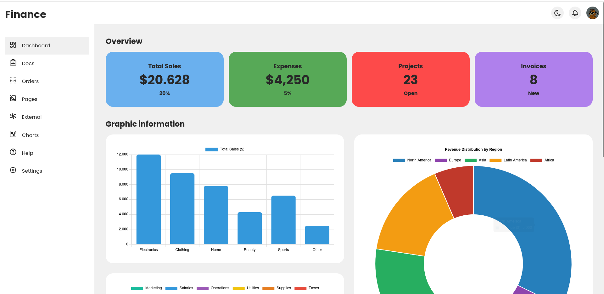

# 💰 Finance Dashboard

An **interactive financial dashboard** built with **HTML**, **CSS**, and **JavaScript**, designed to visualize key financial metrics such as sales, expenses, and revenue in a **modern and dynamic way**.  
It includes a **light/dark mode**, is **fully responsive**, and features **data visualizations** powered by [Chart.js](https://www.chartjs.org/).

---

## 🚀 Key Features

- 🌞🌚 **Light and Dark Mode** — with persistence using `localStorage`.
- 📊 **Dynamic Charts** — display realistic financial data (sales, expenses, regional revenue, and more).
- 📱 **Responsive Design** — adapts perfectly to any screen size.
- 🧭 **Interactive Sidebar** — smooth open/close animations for easy navigation.
- 💾 **Theme Memory** — automatically restores your preferred mode on reload.
- 💼 **Clean and Professional Layout** — ideal for portfolio projects or business use.

---

## 🧩 Technologies Used

| Category | Technology |
|-----------|-------------|
| Languages | HTML5, CSS3, JavaScript (ES6) |
| Data Visualization | [Chart.js](https://www.chartjs.org/) |
| Icons | [Tabler Icons](https://tabler.io/icons) |

---

## 📸 Preview

### 🌞 Light Mode


### 🌚 Dark Mode


---

## ⚙️ Installation & Usage

1. **Clone the repository:**
   ```bash
   git clone https://github.com/yourusername/finance-dashboard.git

---

## ❤️ Acknowledgements

- [Chart.js](https://www.chartjs.org/)  
- [Tabler Icons](https://tabler.io/icons)

---

## 👨‍💻 Author

Created with 💙 by **Alan Chala**

---

## 🏷️ License

This project is licensed under the **MIT License**.  
You are free to use and modify it, provided that proper credit is given.